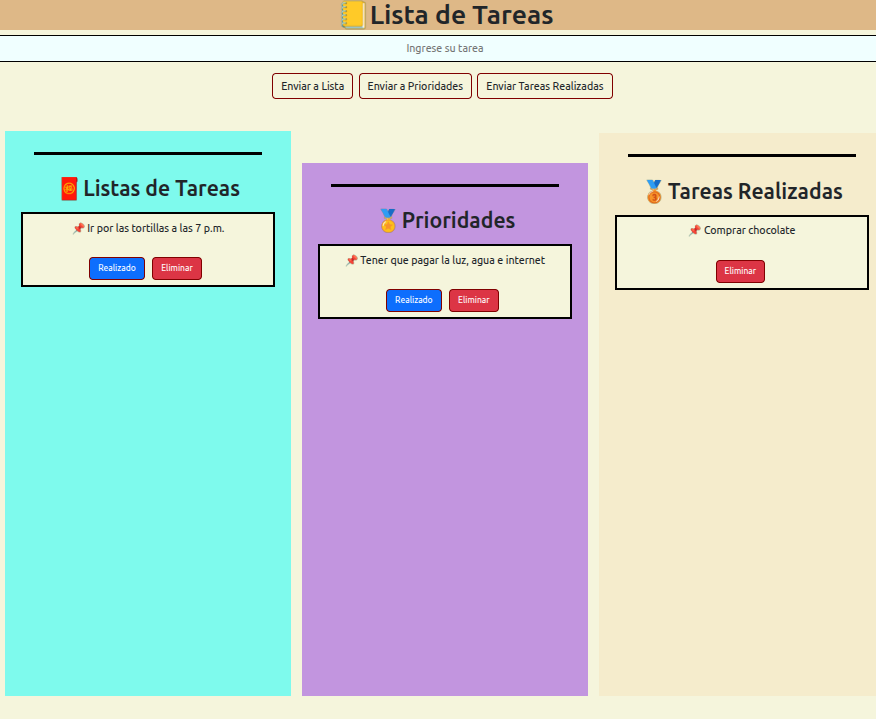

# 🚀 Creación de un To-Do con JS

## 📝 Lista de Tareas
Es un programa que nos permite ingresar el nombre de nuestras tareas y permite adjuntarlas en donde nosotros queremos (tareas, tareas importantes, tareas ya completadas)

## 🎯 Objetivos
- ✅ Entrender el funcionamiento del Dom
- ✅ Mejorar nuestra lógica
- ✅ Tener más conocimientos de Javascript

## Funcionalidades
- Agregar tareas
- Eliminar tareas
- Marcalas como completadas

## 🛠️ Tecnologías / Herramientas Utilizadas
- 🧪 Lenguajes de programación:
    - JavasCript
    - HTML
    - CSS
## 📅 Cronograma / Fases del Proyecto
| 🔢 Fase            | 🕐 Inicio       | 🛑 Finalización | 🗒️ Descripción breve       |
|-------------------|----------------|----------------|-------------------------------|
| Fase 1            | 8/05/2025      | 9/05/2025      | Desarrollo y Finalización     |

## ---------------- Vista previa del Proyecto --------------------

-------------------

## 📬 Contacto
**👤 Responsable:** Agustín López 

**📧 Correo electrónico:** agus77chang@gmail.com  

**📞 Teléfono:** 54505400 
